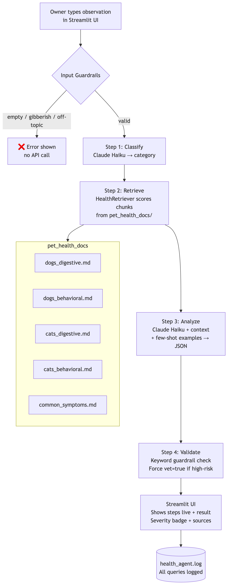
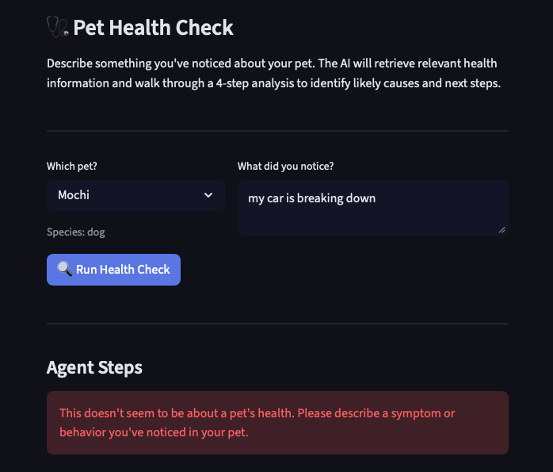

# PawPal+ with AI Health Check

**PawPal+** is a smart pet care scheduling app extended with an AI-powered health analysis system. The original app helps busy pet owners build optimized daily schedules for their pets. This version adds a 4-step agentic health checker that uses Retrieval-Augmented Generation (RAG) to analyze owner observations, retrieve relevant pet health knowledge, and return a severity-rated recommendation — all with observable intermediate steps.

---

## Base Project

**Original project:** PawPal+ (Module 2 — AI110)

PawPal+ was a Streamlit-based pet care scheduler that automatically built daily care schedules around owner availability, pet needs, and task priorities. It featured priority-based scheduling, conflict detection across multiple pets, day load balancing, task batching, and a full dark-mode dashboard. The system had no AI component — all logic was rule-based Python algorithms.

---

## What's New

| Feature | Description |
|---|---|
| **RAG Health Retrieval** | A knowledge base of 5 species-specific markdown documents (dogs/cats × digestive/behavioral + common symptoms) is chunked and scored at query time. The top matching chunks are passed as context to Claude. |
| **Agentic Workflow** | A 4-step agent loop (Classify → Retrieve → Analyze → Validate) with each step's result shown live in the UI. |
| **Few-Shot Specialization** | The analysis prompt includes 3 labeled examples that constrain Claude's tone and output format — caring but clinically accurate, structured JSON. |
| **Guardrails** | Input validation rejects empty, gibberish, and off-topic observations before any API call. Keyword-based escalation forces high severity and vet referral when dangerous symptoms are detected. All queries are logged to `health_agent.log`. |
| **Test Harness** | `test_health_harness.py` runs 9 predefined inputs and prints a pass/fail summary. |

---

## System Architecture

```
Owner Input (Streamlit UI)
        │
        ▼
┌─────────────────────────────────────────────────────┐
│                  Health Agent (health_agent.py)      │
│                                                      │
│  Step 1: Classify                                    │
│    └─ Claude Haiku → symptom category               │
│         (digestive / behavioral / physical)          │
│                                                      │
│  Step 2: Retrieve                                    │
│    └─ HealthRetriever → keyword score chunks        │
│         from pet_health_docs/ (5 .md files)          │
│         Species boost: dog/cat-specific docs ranked  │
│                                                      │
│  Step 3: Analyze                                     │
│    └─ Claude Haiku + retrieved context +            │
│         few-shot examples → JSON response            │
│         {likely_cause, severity, recommendation,     │
│          vet_required}                               │
│                                                      │
│  Step 4: Validate                                    │
│    └─ Keyword guardrail check                       │
│         high-severity keywords → force vet=true      │
│         Log all queries to health_agent.log          │
└─────────────────────────────────────────────────────┘
        │
        ▼
  Streamlit UI — displays steps live + final analysis
        │
        ▼
  Existing PawPal+ Schedule Tab (unchanged)
```



**Data flow:** Owner types an observation → agent classifies it → retriever pulls relevant health doc chunks → Claude analyzes using context + few-shot examples → validator applies safety guardrails → result shown with severity badge, recommendation, and sources.

---

## Setup

```bash
# 1. Clone the repo, switch to the project branch, and enter the project folder
git clone https://github.com/ekaur271/applied-ai-system-project.git
cd applied-ai-system-project
git checkout second_branch
cd ai110-module2show-pawpal-starter

# 2. Create and activate a virtual environment
python3 -m venv .venv
source .venv/bin/activate      # Windows: .venv\Scripts\activate

# 3. Install dependencies
pip install -r requirements.txt

# 4. Add your Anthropic API key
cp .env.example .env           # then open .env and add your key
# ANTHROPIC_API_KEY=sk-ant-...

# 5. Run the app
streamlit run app.py
```

> The `.env` file is gitignored. Never commit your API key.

---

## Sample Interactions

### 1. Mild digestive symptom
**Input:** `my dog has been eating grass and throwing up this morning`

```
Step 1: Classify Symptom        → Category: digestive
Step 2: Retrieve Knowledge      → 4 chunks from dogs_digestive.md, dogs_behavioral.md
Step 3: Analyze with Claude     → Severity: medium
Step 4: Validate Output         → vet_required=False | guardrails applied

MEDIUM SEVERITY
Likely Cause: Mochi is likely experiencing mild stomach upset. Dogs eat grass to
induce vomiting as a self-regulating behavior to clear gastrointestinal irritation.

Recommendation: Monitor for 24 hours. Ensure fresh water is available. If vomiting
continues more than twice or Mochi seems lethargic, contact your vet.
```

---

### 2. High severity — guardrail triggered
**Input:** `my dog is vomiting blood and seems very weak`

```
Step 1: Classify Symptom        → Category: digestive
Step 2: Retrieve Knowledge      → 4 chunks from dogs_digestive.md, common_symptoms.md
Step 3: Analyze with Claude     → Severity: high
Step 4: Validate Output         → keyword 'blood' detected → vet_required=True forced

HIGH SEVERITY
Likely Cause: Vomiting blood combined with weakness is a serious emergency sign
that may indicate internal bleeding, severe gastritis, or poisoning.

Recommendation: Seek veterinary care immediately. ⚠️ Please contact your
veterinarian immediately.
```

---

### 3. Off-topic input — rejected before API call
**Input:** `my car won't start and makes a clicking noise`

```
⚠️ This doesn't seem to be about a pet's health. Please describe a symptom or
behavior you've noticed in your pet.
```
*(No API call made — rejected by keyword guardrail)*

---

## Design Decisions

**Why RAG instead of just prompting Claude directly?**
Sending raw owner observations to Claude with no context produces generic answers. By retrieving species-specific chunks first, the response is grounded in structured pet health knowledge. This also makes the system auditable — the UI shows exactly which source files were used.

**Why keyword retrieval instead of embeddings?**
For a knowledge base of 5 small markdown files, TF-IDF-style keyword scoring is fast, transparent, and requires no vector database setup. The species boost (dog/cat-specific docs score +2) ensures the right documents rank first without any ML overhead.

**Why 4 separate agent steps instead of one prompt?**
Breaking the workflow into Classify → Retrieve → Analyze → Validate makes each step observable and testable. The classification step lets us route to species-specific docs. The validation step applies safety rules independently of the LLM, so guardrails can't be overridden by a model output.

**Why Claude Haiku?**
Fast and cheap for a real-time UI. The few-shot examples and structured JSON output format compensate for the smaller model's lower instruction-following reliability.

---

## Testing Summary

### Evaluation Harness (`test_health_harness.py`)
**Result: 9/9 passed**

| Test | Input | Expected | Result |
|---|---|---|---|
| 1 | Dog eating grass + vomiting | low/medium, no vet | PASS — low |
| 2 | Cat not eating 2 days | high, vet required | PASS — high, vet=True |
| 3 | Dog scratching ears | medium, no vet | PASS — medium |
| 4 | Dog vomiting blood | high, vet (guardrail) | PASS — high, vet=True |
| 5 | Cat can't urinate | high, vet (guardrail) | PASS — high, vet=True |
| 6 | Empty input | error | PASS |
| 7 | Gibberish input | error | PASS |
| 8 | Off-topic (car noise) | error | PASS |
| 9 | Vague input ("dog seems off") | any valid response | PASS — low |

**What worked:** Severity classification was consistent across runs. The keyword guardrail correctly escalated "blood" and "urinate" to high severity without relying on the LLM. Input validation caught all three edge case types before making any API call.

**What didn't work initially:** Claude returned JSON wrapped in markdown fences despite being told not to — fixed by stripping fences before `json.loads()`. The gibberish test initially passed through to Claude and produced a confused output — fixed by adding a real-word count check.

**What I'd add next:** Confidence scoring on the classification step, and tests for multi-symptom observations (e.g., "my dog is vomiting and limping").

### Existing PawPal+ Tests (`tests/test_pawpal.py`)
43 pytest tests covering all scheduling logic — priority ordering, busy block avoidance, conflict detection, batching, and JSON persistence. Run with:
```bash
python -m pytest tests/test_pawpal.py -v
```

---

## Reflection

### AI Collaboration

I used Claude throughout this project — mostly to help me figure out how to structure things I hadn't built before and to write code I could then read through and understand.

**One instance where AI was helpful:** I knew I wanted the health check to show each step as it was happening instead of just showing a final result. I wasn't sure how to do that in Streamlit without the whole page freezing. Claude suggested using a Python generator — basically `yield` each step as it finishes and `return` the final result — and that actually worked really cleanly. I don't think I would've figured that out on my own, at least not quickly.

**One instance where AI's suggestion was flawed:** Claude wrote the prompt to tell the model to return plain JSON with no markdown formatting. When I ran it for the first time it came back wrapped in code fences anyway and the whole thing crashed. The fix was easy once I knew what was wrong, but it was kind of a wake-up call that you can't just tell a model to do something and trust that it will. You have to handle whatever it actually sends back.

### Limitations and Biases

- **The knowledge base is really small.** I only wrote 5 markdown files covering basic dog and cat symptoms. If someone types in something unusual or less common, the system has no relevant docs to pull from and just relies on what Claude already knows, which might not be accurate.
- **Keyword matching breaks down with natural language.** If someone types "my dog won't eat" that might not match well against a chunk that says "loss of appetite." The retrieval works better when people use more specific words, which isn't how most people actually talk.
- **It doesn't remember anything between sessions.** Every health check starts from scratch. If the same pet has had the same symptom multiple times, the system has no idea — it just sees one message at a time.
- **The model isn't trained on veterinary data.** Claude Haiku is a small general-purpose model. I shaped its responses with examples in the prompt but it's not actually a medical system and shouldn't be treated like one.

### Could This Be Misused?

The most realistic risk is someone reading "low severity" and deciding their pet is fine when it actually isn't. To try to prevent that I added a keyword guardrail that forces the severity to high and adds a vet warning whenever the input includes words like "blood," "seizure," or "can't urinate" — that happens in the code, not in the model, so it can't be overridden by a bad response. Every output also ends with a reminder that this isn't real veterinary advice.

### What Surprised Me While Testing

Honestly the first surprise was just how fast things broke. I had tested the imports, confirmed the API key worked, and felt pretty good about it — and then the first actual run crashed because the JSON parser got a code block instead of plain JSON. I hadn't thought about that at all. It made me realize that testing pieces individually doesn't tell you much about whether the whole thing works.

The other thing that surprised me was that the simplest guardrails worked the best. The empty input check and the off-topic check both passed immediately and didn't even touch the API. I expected those to be the hard ones to get right but they were just a few lines of string checking. Meanwhile getting the model to return clean JSON took multiple tries.

I also didn't expect the vague input test to work as well as it did. "My dog seems off today" felt like it would just confuse the system but it still came back with a reasonable response. The examples I put in the prompt seemed to help more than I expected.

### What This Taught Me About AI and Problem-Solving

This was my first time building something where an LLM is actually part of a real working app, not just a script that calls an API. The thing that stood out most to me is how much of the work has nothing to do with the model itself. Writing the knowledge docs, structuring the retrieval, deciding what gets validated in code vs. what gets decided by the AI — that's where most of the time went. The model call is almost the easy part. What's hard is making sure the inputs are clean, the outputs are handled correctly, and there are guardrails for when things go wrong. I came in thinking AI engineering was mostly about prompting. I'm leaving thinking it's mostly about the stuff around the prompt.

---

## Portfolio

**GitHub:** [github.com/ekaur271/applied-ai-system-project](https://github.com/ekaur271/applied-ai-system-project) — branch: `second_branch`

**What this project says about me as an AI engineer:**
I'm a CS student still learning how all of this works, but this project showed me that I can take something I already built and make it genuinely smarter — not just by plugging in a model but by thinking through where AI actually helps and where regular code is more reliable. I ran into real problems, debugged them, added tests I hadn't thought of originally, and ended up with something that works consistently. I want to keep building things that prove they work rather than just looking like they do.

---

## Future Ideas

There are a lot of directions this could go that I didn't have time to build out:

- **Follow-up questions** — right now the agent takes one observation and gives one answer. A better version would have the AI ask clarifying questions before giving a recommendation, like "how long has this been going on?" or "is your pet still drinking water?" That would get closer to how a real triage conversation works.
- **Symptom history and tracking** — the system currently has no memory between sessions. It would be really useful to log symptoms over time so you could see patterns, like if the same pet has had digestive issues three weeks in a row. That kind of history would also make the AI's responses more accurate since it would have context.
- **Voice to text input** — typing out a symptom description isn't always easy, especially if you're worried about your pet. Adding a voice input option would make the tool feel more natural to use.
- **Better retrieval** — keyword matching misses a lot of cases where the owner uses different words than what's in the docs. Switching to embedding-based retrieval would make the RAG step much more accurate and handle natural language better.
- **Vet connection** — the system currently just tells you to "contact your vet." A more useful version could have a direct way to find nearby vets, send a summary of the symptoms to your vet, or even book an appointment. The AI-generated summary could actually be a useful thing to share with a vet as a starting point.
- **More species** — the knowledge base only covers dogs and cats right now. Adding docs for rabbits, birds, and other common pets would make the tool useful for more people.

---

## Project Structure

```
ai110-module2show-pawpal-starter/
├── app.py                    # Streamlit UI — Schedule + Health Check tabs
├── pawpal_system.py          # Original scheduling backend (unchanged)
├── health_agent.py           # 4-step agentic health analysis loop
├── health_retriever.py       # RAG retriever — keyword chunk scoring
├── test_health_harness.py    # Evaluation harness (9 test cases)
├── pet_health_docs/          # RAG knowledge base
│   ├── dogs_digestive.md
│   ├── dogs_behavioral.md
│   ├── cats_digestive.md
│   ├── cats_behavioral.md
│   └── common_symptoms.md
├── tests/
│   └── test_pawpal.py        # 43 original pytest tests
├── requirements.txt
├── .env                      # API key (gitignored)
└── .streamlit/
    └── config.toml           # Dark mode theme
```

---

## Demo Walkthrough

[▶ Watch the demo walkthrough](../assets/PawPal+_video.mov)

### Guardrail Example

Off-topic input rejected before any API call is made:



---

*This project does not provide veterinary advice. Always consult a licensed veterinarian for your pet's health.*
