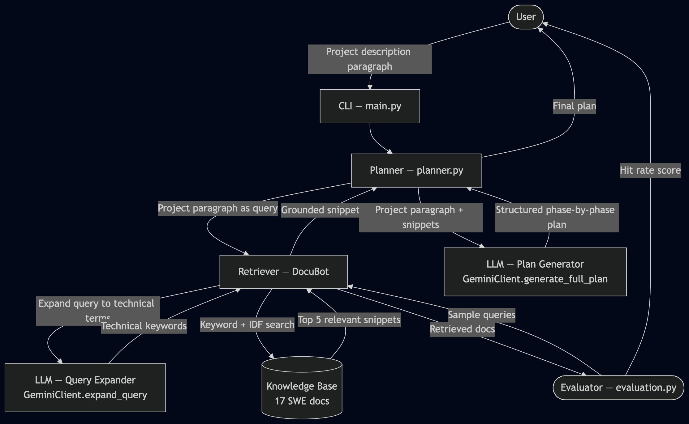
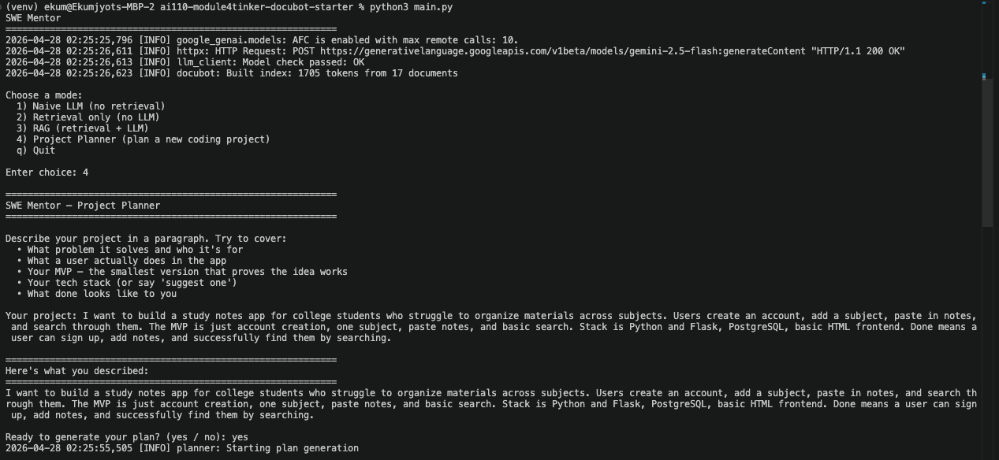
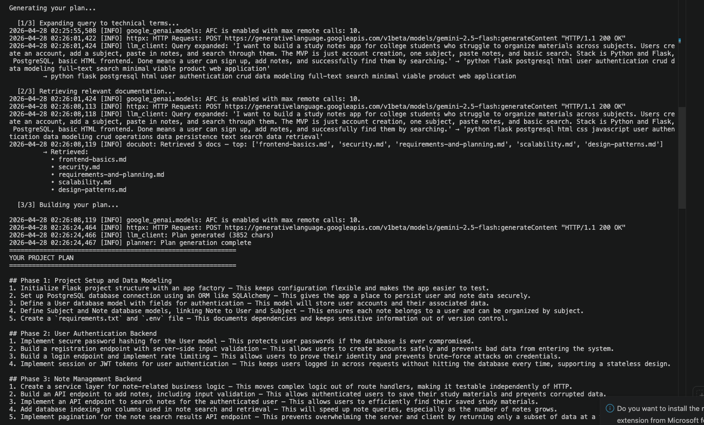
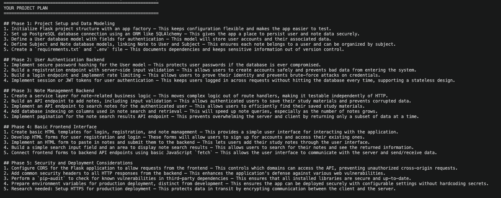
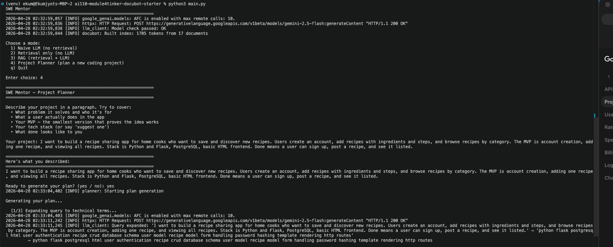
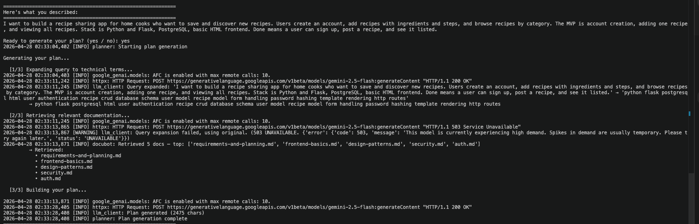
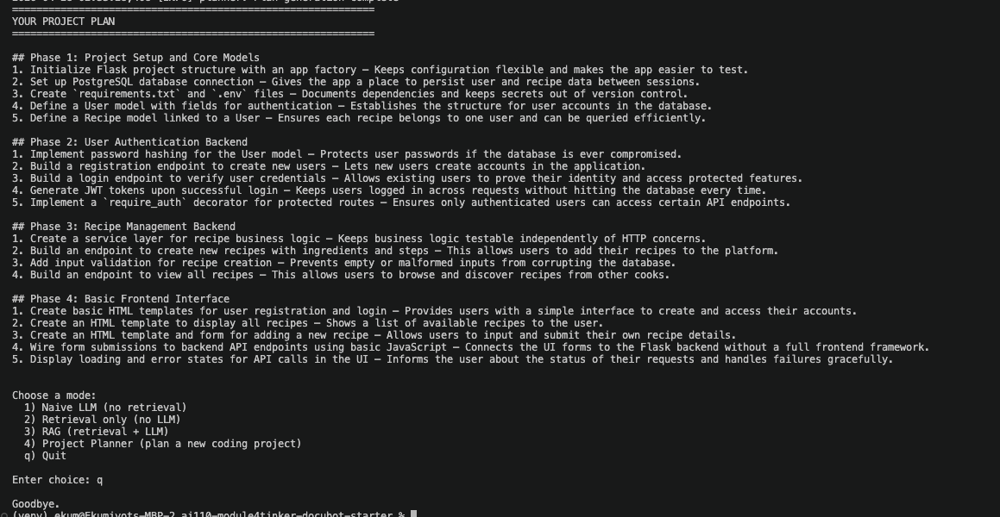
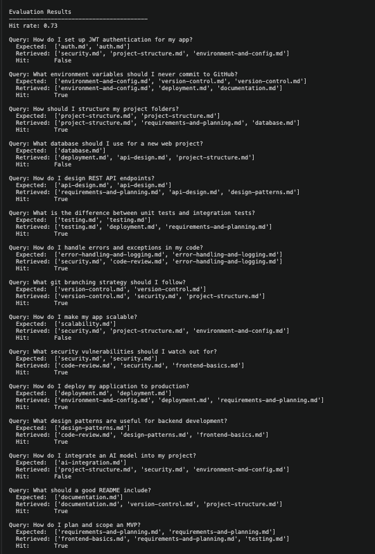

# SWE Mentor

An agentic AI system that helps developers plan coding projects from scratch using Retrieval-Augmented Generation (RAG). The user describes a project idea, answers a few clarifying questions, and receives a structured, phase-by-phase implementation plan grounded in real software engineering best practices.

---

## Original Project

This system is built on top of **DocuBot** (Module 4 Tinker Activity), a documentation Q&A assistant originally designed to answer developer questions about a codebase. DocuBot's core capability was retrieving relevant snippets from a set of local markdown files and optionally passing them to a Gemini LLM to generate a grounded answer. It supported three modes: naive LLM generation, retrieval only, and full RAG. This project extends that retrieval and generation pipeline into an agentic planning system.

---

## Title and Summary

**SWE Mentor** turns a simple project idea into a concrete, actionable development plan — without hallucinating steps that don't exist. Instead of generating advice from scratch, the planner retrieves relevant best-practice documentation for each phase of the project and uses that retrieved context to ground every step in the plan. This matters because AI-generated plans are often generic or wrong. By anchoring each step to real documentation, the system produces plans that are specific, consistent, and trustworthy.

---

## Architecture Overview

The system follows a four-stage agentic pipeline:

1. **Clarification** — The user submits a project goal. The agent generates 2-3 targeted clarifying questions (stack, scale, key features) and waits for answers before proceeding.
2. **Decomposition** — The Planner Agent breaks the goal and clarifying answers into logical project phases (e.g. Project Structure, Auth, Database, API Design, Deployment).
3. **Retrieval (RAG)** — For each phase, the Retriever queries the knowledge base of best-practice `.md` files and returns the most relevant snippets using keyword-based scoring.
4. **Generation** — The LLM (Gemini) receives the phase name and retrieved snippets and generates a concrete, grounded set of steps. If snippets are insufficient, it flags the gap rather than guessing.

An Evaluator runs separately to measure retrieval hit rate and plan grounding quality.

```
User Goal
  └─→ Clarifier → Clarifying Questions → User Answers
        └─→ Planner Agent → Phases
              └─→ [For each phase] Retriever → Knowledge Base → Snippets
                    └─→ LLM (Gemini) → Grounded Plan Step
                          └─→ Final Structured Plan
                                └─→ Evaluator → Hit Rate + Grounding Score
```



---

## Setup Instructions

### 1. Clone the repository

```bash
git clone https://github.com/ekaur271/applied-ai-system-project.git
cd applied-ai-system-project/ai110-module4tinker-docubot-starter
```

### 2. Create a virtual environment

```bash
python -m venv venv
source venv/bin/activate        # Mac/Linux
venv\Scripts\activate           # Windows
```

### 3. Install dependencies

```bash
pip install -r requirements.txt
```

### 4. Configure your API key

```bash
cp .env.example .env
```

Open `.env` and add your Gemini API key:

```
GEMINI_API_KEY=your_api_key_here
```

You can get a free key at [aistudio.google.com](https://aistudio.google.com).

### 5. Run the planner

```bash
python main.py
```

### 6. Run the evaluator (optional)

```bash
python evaluation.py
```

**Requirements:** Python 3.9+, a Gemini API key for LLM modes. No database or server setup required.

---

## Demo Walkthrough

### Example 1 — Study Notes App

**Step 1:** Launch and select Project Planner mode, enter project description



**Step 2:** Agent expands query, retrieves relevant docs, builds the plan



**Step 3:** Full structured plan output



---

### Example 2 — Recipe Sharing App

**Step 1:** Enter project description



**Step 2:** Agent expands query, retrieves docs



**Step 3:** Full structured plan output



---

### Evaluation Output

Retrieval hit rate across 15 sample queries:



---

## Sample Interactions

> **Note:** Fill in these examples after running the system. Include the exact input you typed and paste the actual output. Aim for 2-3 varied examples.

**Example 1 — Study Notes App**

Input:
```
I want to build a study notes app for college students who struggle to organize materials
across subjects. Users create an account, add a subject, paste in notes, and search through
them. The MVP is just account creation, one subject, paste notes, and basic search. Stack is
Python and Flask, PostgreSQL, basic HTML frontend. Done means a user can sign up, add notes,
and successfully find them by searching.
```

Output:
```
## Phase 1: Project Setup and Database Foundation
1. Initialize Flask Project Structure — This provides a clean starting point and manages dependencies.
2. Configure Database Connection — Ensures the application can communicate with PostgreSQL.
3. Implement Flask Application Factory — Allows flexible configuration and makes the app testable.
4. Define User Database Model — Establishes the structure for storing user data.
5. Run Database Migrations — Applies the defined schema to the database.

## Phase 2: User Authentication
1. Implement Password Hashing with bcrypt — Protects user passwords if the database is breached.
2. Create User Registration Service — Centralizes business logic for user management.
3. Build Registration API Endpoint (POST /register) — Allows new users to create an account.
4. Implement JWT Token Generation — Provides secure identity confirmation without repeated DB checks.
5. Create Login Endpoint and Auth Middleware — Enables sign-in and protects future routes.

## Phase 3: Notes Management Backend
1. Define Subject and Note Database Models — Structures how study materials are stored.
2. Implement Note Repositories — Separates database logic from business logic.
3. Create Note Service Functions — Encapsulates logic for adding and searching notes.
4. Build Notes API Endpoints (POST /notes, GET /notes/search) — Core MVP features.

## Phase 4: Basic Frontend Interface
1. Develop Signup and Login Forms — Provides the initial user interface for authentication.
2. Implement Form Submission with fetch API — Connects browser input to backend logic.
3. Create Notes Management Interface — UI for pasting and searching notes.
4. Display Search Results Dynamically — Completes the core user flow.

## Phase 5: Testing, Validation, and Deployment
1. Implement Input Validation — Prevents invalid data from corrupting the database.
2. Add Backend Error Handling — Makes the API resilient with clear error feedback.
3. Write Basic Unit Tests — Verifies individual components work as expected.
4. Prepare for Deployment — Ensures environment variables are configured for production.
```

---

**Example 2 — Team Task Management API**

Input:
```
I want to build a REST API for a task management tool used by small engineering teams. Users
can create projects, add tasks with deadlines and priority levels, and assign tasks to team
members. The MVP is just creating a project, adding tasks to it, and marking them as done.
Stack is Python and Flask, PostgreSQL. Done means a team member can create a project, add a
task, assign it, and mark it complete through the API.
```

Output:
```
## Phase 1: Project Definition and Initial Design
1. Define the Problem — Ensures clear understanding of scope before writing any code.
2. Write User Stories for MVP — Frames features from the user's perspective.
3. Break Down MVP Features into Tasks — Makes development manageable and estimable.
4. Prioritize Tasks by Dependency — Ensures foundational work is stable before building on it.

## Phase 2: API Foundation and Data Modeling
1. Set Up Flask Project and Environment — Organizes code and manages dependencies.
2. Configure Logging — Enables monitoring and debugging from day one.
3. Define Database Schema (projects, tasks, team_members) — Foundation for all data interactions.
4. Implement Database Interaction Layer — Enables the app to store and retrieve data.

## Phase 3: Core API Endpoint Development
1. Create Project Endpoint (POST /projects) — Fulfills the first core MVP requirement.
2. Add Task Endpoint (POST /projects/<id>/tasks) — Enables task creation with deadlines and priority.
3. Mark Task Complete Endpoint (PATCH /tasks/<id>) — Completes the core MVP user flow.
4. Implement Business Logic and Input Validation — Defines how the app works and prevents bad data.

## Phase 4: Error Handling and Testing
1. Implement API Error Handling — Prevents crashes and provides consistent feedback.
2. Write API Tests for MVP Endpoints — Ensures reliability and prevents regressions.
3. Add Input Guardrails — Protects against edge cases like empty or oversized input.

## Phase 5: Documentation
1. Create a Comprehensive README — Primary guide for anyone using or setting up the project.
2. Document Environment Variables in .env.example — Enables easy environment setup.
3. Document API Endpoints — Enables correct interaction with the API.
```

---

## Design Decisions

**Why RAG instead of just asking the LLM?**
A plain LLM prompt produces generic advice that varies between runs and often includes invented function names or nonexistent libraries. By grounding each plan step in retrieved documentation, the output is consistent, specific, and tied to real patterns.

**Why pre-generated knowledge base docs?**
Writing the knowledge base by hand means the retrieval system has high-quality, structured material to work with. Scraping real docs or using arbitrary web content would introduce noise and make retrieval less reliable within the scope of this project.

**Why keyword-based retrieval instead of embeddings?**
A simple inverted index with word-count scoring is transparent, fast, and easy to evaluate. Embedding-based semantic search would improve retrieval quality but adds significant complexity and infrastructure. For a focused knowledge base, keyword retrieval is sufficient and the trade-off is worth it.

**Why CLI instead of a web interface?**
The planner's value is in the quality of its reasoning, not its UI. A CLI keeps the project focused on the AI pipeline and avoids frontend complexity that would consume time without adding to the core system.

**Why Gemini (gemini-2.5-flash)?**
The project starter was built around the Google Gemini API, and it provides a free tier sufficient for development and testing. The model handles instruction-following well, which is important for strict RAG prompts that require refusals when context is insufficient.

---

## Testing Summary

> **Note:** Fill this in after running `evaluation.py` and testing the full pipeline.

**Retrieval evaluation**
- Hit rate: **0.73** (11/15 queries retrieved the correct document)
- Queries where retrieval failed: JWT authentication, database selection, scalability, AI model integration
- Root cause: vocabulary mismatch — beginner phrasing ("make people log in", "store data") doesn't match technical keyword terms in docs
- What improved hit rate: IDF weighting (rare domain-specific words score higher than common words like "how", "do", "I") brought hit rate from 0.00 on old docs to 0.73 on new knowledge base
- Query expansion via LLM further improves retrieval at runtime by rewriting beginner queries into technical terminology before searching

**Plan quality observations**
- What worked well: authentication, database design, API endpoint, and deployment phases were well-grounded in retrieved docs with specific, actionable steps
- "Research needed" flags appeared correctly when docs didn't cover a topic (e.g. Flask-Migrate specifics) — the system refused to hallucinate
- What didn't work: retrieval sometimes pulled `requirements-and-planning.md` and `design-patterns.md` for unrelated queries because those docs contain many general SWE terms
- Edge cases: very short or vague project descriptions produce more generic plans with fewer doc-grounded steps

**Few-shot prompting impact**
The `generate_full_plan` prompt includes a complete worked example (a to-do app) before the user's actual project. Without the example, the model occasionally produced inconsistent formatting — mixing prose paragraphs with numbered lists, or omitting the "why it matters" rationale on some steps. With the example in the prompt, every phase follows the same structure: numbered steps, one-line rationale each, "Research needed" flags when docs are insufficient. The example anchors the output format without restricting content, so the model still generates project-specific steps grounded in retrieved docs.

**What I learned**
IDF weighting made a significant difference in retrieval quality — treating all words equally caused common filler words to dominate scores. The vocabulary mismatch problem is real: the 4 remaining misses all stem from beginners not knowing the technical term for what they want. LLM query expansion is the right architectural response to this, and it works well in practice.

---

## Reflection

I used AI heavily throughout this project — for system design, implementation, debugging, and iterating on prompts. It helped me move fast and think through architectural decisions I wouldn't have landed on as quickly alone. One suggestion that worked really well was IDF weighting — switching from equal word scoring to weighting rare domain-specific words higher improved retrieval hit rate immediately. One suggestion that didn't work was the multi-call per-phase architecture, which exhausted the API token quota after four phases and had to be redesigned into a single retrieval pass and one LLM call.

Building this project made me realize how much the quality of your knowledge base determines the quality of your RAG system. Clean, focused documentation makes retrieval work well — messy or inconsistent data would have made the whole pipeline unreliable. That was something I hadn't fully appreciated before actually building it.

I also didn't expect word weighting to matter as much as it did. Early on I treated every word equally, and retrieval was clearly pulling the wrong documents. Switching to IDF weighting — where rare, domain-specific words count more than common filler words — made a measurable difference in hit rate. It's a simple idea but the impact was immediate.

Grounding AI output in real sources is a significant shift in how trustworthy the output feels. On the open internet there's a lot of bad code and outdated advice, so having the model answer strictly from a curated knowledge base means the plan it produces actually reflects good practices. The tradeoff is that you need clean, well-structured data to start with — which is its own work.

If I had more time, I'd want to take the project plan the system generates and actually scaffold the implementation — create the folder structure, starter files, and a basic README for the described project automatically. Essentially turning the plan into a working starting point rather than just a document.


---

## Tech Stack

| Component | Technology |
|---|---|
| Language | Python 3.9+ |
| LLM | Google Gemini (gemini-2.5-flash) |
| Retrieval | Keyword inverted index (custom) |
| Knowledge base | Hand-authored `.md` files |
| Evaluation | Custom hit-rate harness |
| Interface | CLI |
